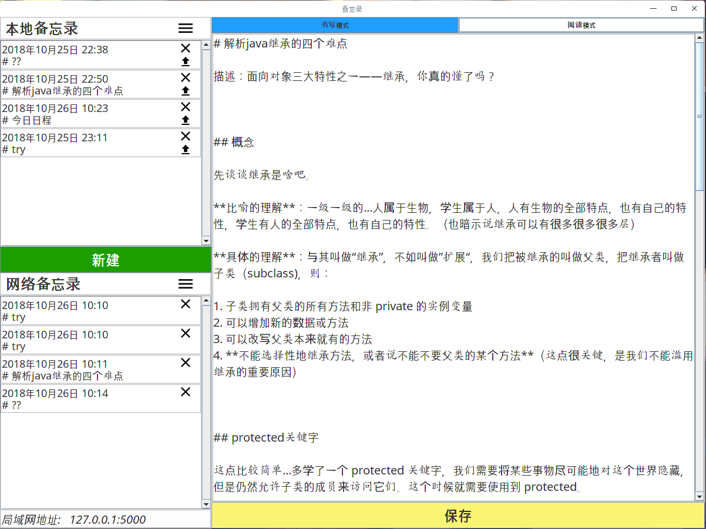
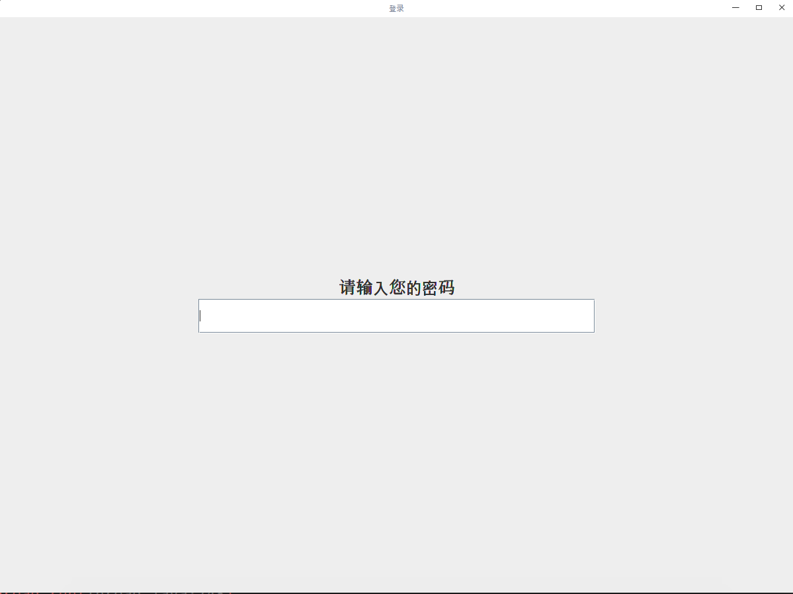
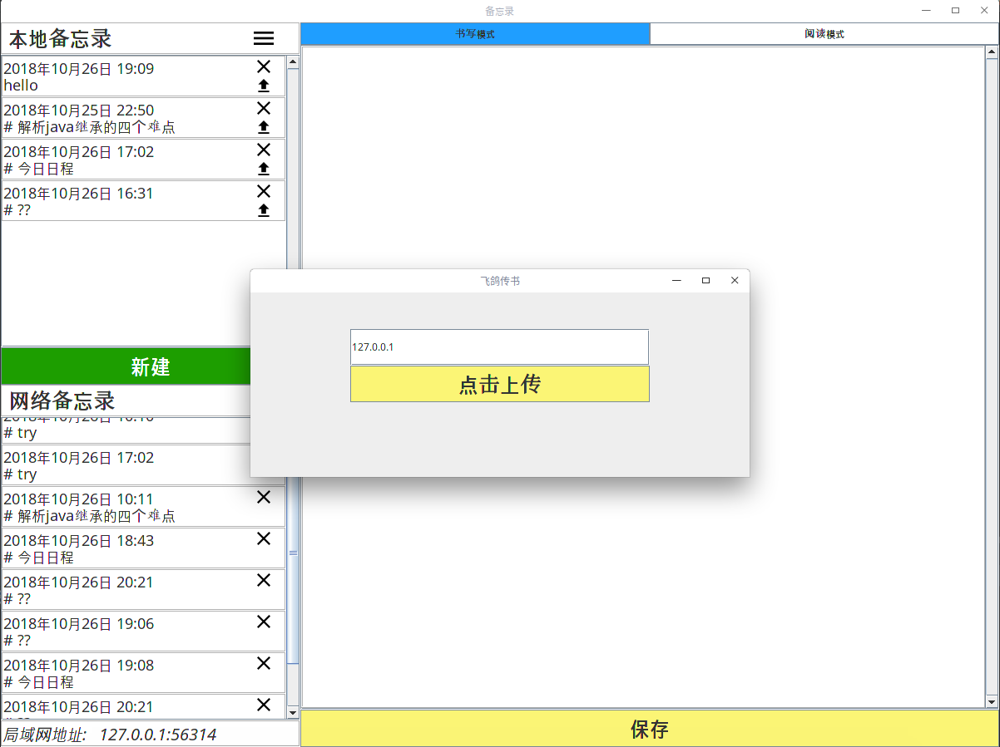

# java 备忘录
> 基于 java 实现的备忘录，支持 markdown 的写作和预览，严格遵守 MVC 模式

[![Build Status][travis-image]][travis-url]

原型为北京交通大学软件学院高级程序设计实践作业备忘录，在其基础上增添 markdown 功能（不支持 markdown 的备忘录没有灵魂）

## Usage

已建立 idea 工程，下载后往项目添加根目录 tablelayout.jar 依赖，客户端主函数在Memo/Main中，服务器主函数在 Memo/Server 中。

若要使用网络备忘录功能，请带 yes 参数启动客户端主函数

**一、密码界面**

需要输入密码，验证密码正确后，才能进入备忘录。首次进入软件时，需要设置密码。

 

  

**二、主页面**

1. 支持备忘录的新建、删除、修改，支持 markdown 格式，保存后即可预览 
2. 若 Server 部署在了服务器/本地上并运行，可以再客户端点“上传”图标上传到服务器，服务器广播到所有客户端，并且保存在每个客户端中，同时客户端的网络备忘录也可修改

## Contact me:

